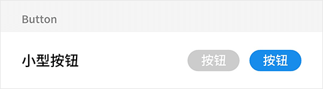
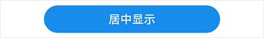
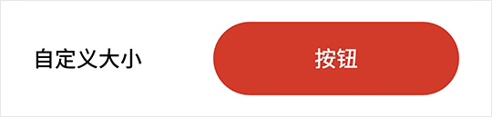

# Button 按钮

## Button Snippets

### 基础使用

正常尺寸按钮通常位于底栏右侧：

```html
<fm-Button color="#3bc06b">按钮</fm-Button>
```


### 小型按钮

小型按钮通常位于列表项右侧：

```html
<fm-Button :disabled="true" size="small">按钮</fm-Button>
<fm-Button size="small">按钮</fm-Button>
```



### 大型按钮

大型按钮通常位于底栏两侧：

```html
<fm-button size="large" color="#7e97ac">取消订单</fm-button>
<fm-button size="large" color="#f12528">提交订单</fm-button>
```


### 超大按钮

超大按钮通常位于底栏中心：

```html
<fm-button size="huge">居中显示</fm-button>
```



### 自定义按钮

若预设的按钮大小不满足要求，您还可进行自定义：

```html
<fm-Button :width="50" :height="15" color="#d33a2a">按钮</fm-Button>
```



### 圆形按钮

除了普通的腰圆按钮，我们还预设了圆形按钮，该按钮通常作为底部悬浮按钮存在：

```html
<fm-Button :disabled="true" type="circle" icon="back"></fm-Button>
<fm-Button type="circle" icon="home" color="#f12528"></fm-Button>
<fm-Button type="circle" icon="user" color="#ffaf00"></fm-Button>
```


## Button Props

| 参数名称 | 描述 | 类型 | 默认值 | 可选值 |
| ----- | ----- | ----- | ----- | ----- |
| color | 按钮背景颜色 | String | #198ded | -- |
| disabled | 按钮是否不可用 | Boolean | false | true, false |
| type | 按钮类型 | String | -- | circle |
| icon | 圆形按钮图标 id，`type = circle` 时有效 | String | -- | 详见 [Icon 图标](icon.md) 组件 |
| size | 按钮尺寸，`type = circle` 时无效 | String | -- | small, large, huge |
| width | 按钮宽度（单位 vw），`type` 与 `size` 均为空时有效 | Number | -- | -- |
| height | 按钮高度（单位 vw），`type` 与 `size` 均为空时有效 | Number | -- | -- |

## Button Events

| 事件名称 | 描述 | 参数 |
| ----- | ----- | ----- |
| click | 点击按钮时触发 | 原生 `event` 对象 |

## Button Slots

| 插槽名称 | 描述 |
| ----- | ----- |
| -- | 按钮显示文本，`type = circle` 时无效 |