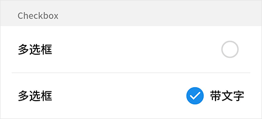

# Checkbox 多选框

## Checkbox Snippets

```html
<template>
    <fm-checkbox v-model="status">带文字</fm-checkbox>
</template>
<script>
    export default {
        data: () => ({
            status: true
        })
    }
</script>
```



## Checkbox Directives

| 指令名称 | 描述 | 类型 |
| ----- | ----- | ----- |
| v-model | 多选框是否被选中 | Boolean |

## Checkbox Props

| 参数名称 | 描述 | 类型 | 默认值 | 可选值 |
| ----- | ----- | ----- | ----- | ----- |
| color | 多选框被选中后的颜色 | String | #198ded | -- |

## Header Slots

| 插槽名称 | 描述 |
| ----- | ----- |
| -- | 多选框文字插槽 |