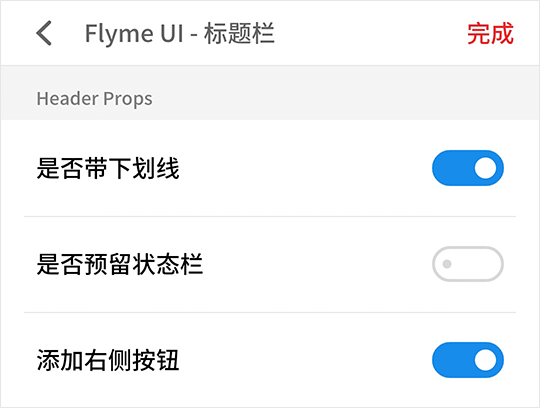

# Header 标题栏

> 使用该组件会在 `body` 元素上加上与标题栏等高的上内边距。

## Header Snippets

```html
<fm-header :statusbar="false" title="Flyme UI - 标题栏">
    <div style="font-size: 4.444vw; font-weight: 500; color: #f12528;">完成</div>
</fm-header>
```



## Header Props

| 参数名称 | 描述 | 类型 | 默认值 | 可选值 |
| ----- | ----- | ----- | ----- | ----- |
| title | 标题 | String | document.title | -- |
| color | 标题字体颜色 | String | #666 | -- |
| background-color | 标题栏背景颜色 | String | #fff | -- |
| underline | 是否显示下划线 | Boolean | true | true, false |
| statusbar | 是否预留状态栏位置 | Boolean | true | true, false |

## Header Events

| 事件名称 | 描述 | 参数 |
| ----- | ----- | ----- |
| back | 点击返回图标时触发 | -- |

## Header Slots

| 插槽名称 | 描述 |
| ----- | ----- |
| -- | 标题栏右侧元素插槽 |