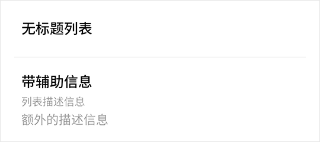
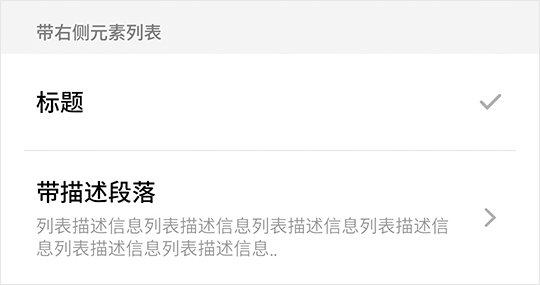
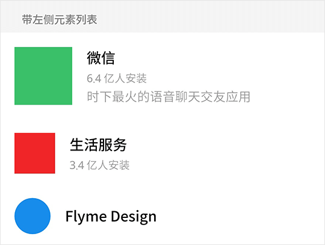

# List 列表

列表基础组件，可灵活自定义，更多高度封装列表组件详见：

* [RadioList 单选列表](radio-list.md)

* [SwitchList 开关列表](switch-list.md)

## List Snippets

### 基础用法

```html
<fm-list>
    <fm-list-item title="无标题列表"></fm-list-item>
    <fm-list-item title="带辅助信息" content="列表描述信息" desc="额外的描述信息"></fm-list-item>
</fm-list>
```



### 带右侧元素

```html
<fm-list title="带右侧元素列表">
    <fm-list-item title="标题">
        <fm-icon :size="5" id="tick" color="#b2b2b2" slot="right"></fm-icon>
    </fm-list-item>
    <fm-list-item title="带描述段落" content="列表描述信息列表描述信息列表描述信息列表描述信息列表描述信息..">
        <fm-icon :size="5" :rotate="180" id="back" color="#b2b2b2" slot="right"></fm-icon>
    </fm-list-item>
</fm-list>
```



### 带左侧元素

```html
<fm-list :underline="false" title="带左侧元素列表">
    <fm-list-item title="微信" content="6.4 亿人安装" desc="时下最火的语音聊天交友应用">
        <div style="width: 17.778vw; height: 17.778vw; background: #3bc06b;" slot="left"></div>
    </fm-list-item>
    <fm-list-item title="生活服务" content="3.4 亿人安装">
        <div style="width: 12.5vw; height: 12.5vw; background: #f12528;" slot="left"></div>
    </fm-list-item>
    <fm-list-item title="Flyme Design">
        <div style="width: 11.112vw; height: 11.112vw; border-radius: 50%; background: #198ded;" slot="left"></div>
    </fm-list-item>
</fm-list>
```



## List Props

| 参数名称 | 描述 | 类型 | 默认值 | 可选值 |
| ----- | ----- | ----- | ----- | ----- |
| title | 列表标题 | String | -- | -- |
| underline | 是否显示列表项下划线 | Boolean | true | true, false |
| active-effect | 是否显示列表项点击效果 | Boolean | true | true, false |

## List Slots

| 插槽名称 | 描述 |
| ----- | ----- |
| -- | 列表项插槽 |

## ListItem Props

| 参数名称 | 描述 | 类型 | 默认值 | 可选值 |
| ----- | ----- | ----- | ----- | ----- |
| title | 列表项标题 | String | -- | -- |
| content | 列表项内容（字号较小） | String | -- | -- |
| desc | 列表项项描述（字号较大） | String | -- | -- |

## ListItem Slots

| 插槽名称 | 描述 |
| ----- | ----- |
| -- | 主体内容插槽，替换所有 Props 元素 |
| left | 左侧内容插槽 |
| right | 右侧内容插槽 |