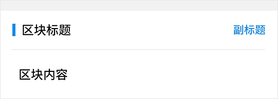

# Plate 板块

## Plate Snippets

```html
<fm-plate title="区块标题">
    <div slot="subtitle">副标题</div>
    <fm-list :active-effect="false">
        <fm-list-item title="区块内容">
        </fm-list-item>
    </fm-list>
</fm-plate>
```



## Plate Props

| 参数名称 | 描述 | 类型 | 默认值 | 可选值 |
| ----- | ----- | ----- | ----- | ----- |
| title | 板块标题 | String | -- | -- |
| color | 板块主题色 | String | #198ded | -- |
| underline | 是否显示下划线 | Boolean | true | true, false |
| separate | 是否显示顶部分割条 | Boolean | true | true, false |

## Plate Slots

| 插槽名称 | 描述 |
| ----- | ----- |
| -- | 板块主题内容 |
| subtitle | 板块副标题 |