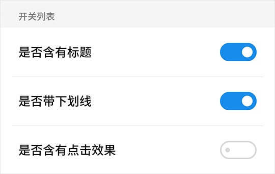

# SwitchList 开关列表

> 该组件基于 [List 列表](list.md) 与 [Switch 开关](switch.md) 组件封装

## SwitchList Snippets

```html
<template>
    <fm-switch-list :data="options" :title="options[0].switch ? '开关列表' : ''" :underline="options[1].switch" :active-effect="options[2].switch"></fm-switch-list>
</template>
<script>
    export default {
        data: () => ({
            options: [
                {
                    name: '是否含有标题',
                    switch: true
                }, {
                    name: '是否带下划线',
                    switch: true
                }, {
                    name: '是否含有点击效果',
                    switch: false
                }
            ]
        })
    }
</script>
```



## SwitchList Props

| 参数名称 | 描述 | 类型 | 默认值 | 可选值 |
| ----- | ----- | ----- | ----- | ----- |
| title | 列表标题 | String | -- | -- |
| underline | 是否显示列表项下划线 | Boolean | true | true, false |
| active-effect | 是否显示列表项点击效果 | Boolean | false | true, false |
| color | 开关颜色 | String | #198ded | -- |
| data | 开关列表数据数组 | Array | -- | -- |
| prop-name | 列表项标题字段名 | String | name | -- |
| prop-switch | 列表项开关状态字段名 | String | switch | -- |