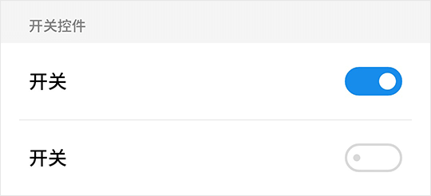

# Switch 开关

## Switch Snippets

```html
<fm-switch v-model="status"></fm-switch>
```



## Switch Directives

| 指令名称 | 描述 | 类型 |
| ----- | ----- | ----- |
| v-model | 开关开启状态 | Boolean |

## Switch Props

| 参数名称 | 描述 | 类型 | 默认值 | 可选值 |
| ----- | ----- | ----- | ----- | ----- |
| color | 开关颜色 | String | #198ded | -- |