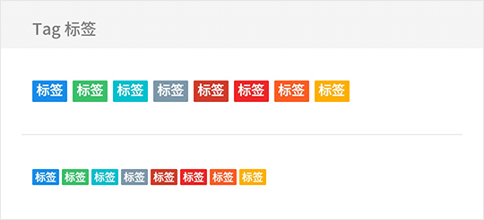

# Tag 标签

## Tag Snippets

```html
<fm-tag>标签</fm-tag>
<fm-tag color="#3bc06b">标签</fm-tag>

<!-- 小标签 -->
<fm-tag size="small">标签</fm-tag>
<fm-tag size="small" color="#3bc06b">标签</fm-tag>
```



## Tag Props

| 参数名称 | 描述 | 类型 | 默认值 | 可选值 |
| ----- | ----- | ----- | ----- | ----- |
| color | 标签颜色 | String | #198ded | -- |
| size | 标签显示尺寸 | String | -- | small |
